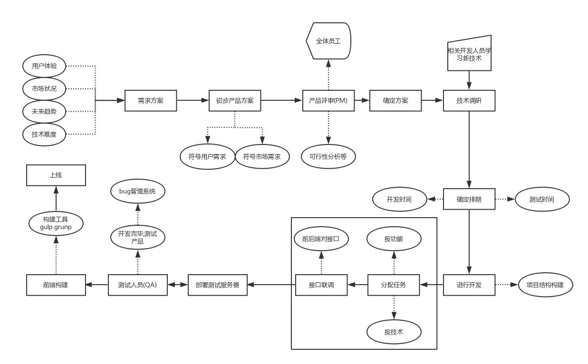
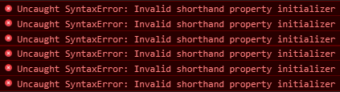
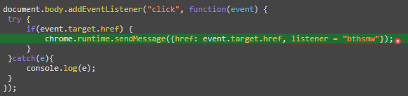

### 如何使用

安装:
```npm install```

运行:
```npm start```

访问:
http://localhost:3000

## 到位APP开发备忘录

### 进度 (8/13/2017)
	
- 11个静态页面；
- 首页、服务商列表、地址、商品详情等页面的数据动态获取并展示
- 很多页面交互效果
- 三个表单的前端验证(伪数据)
- 五条后台路由
- 1700余行JSON数据(团队协作的成果)
- [GitHub链接](https://github.com/wuyax/daowayWithServer)

---

### 技术选型
1. jQuery实现页面交互效果，获取数据等，简化代码量，加快开发效率
	- jquery.vaildata.js-实现表单验证功能
	- SuperSlide-实现轮播图
2. qrcode.js 动态生成二维码
3. gVerify.js 生成图形验证码
4. 前端模板技术art-Template 写vue项目一样写jQuery项目
5. ES5 语法执行ES5标准
6. node.js搭建后台服务器
	1. express 基于 Node.js 平台，快速、开放、极简的 web 开发框架。
	2. body-parser 解析post请求的请求体
	3. EJS 后台模板技术
6. bootstrap 前端框架，简单易用的组件


### 开发流程

此处省略1W字。


**实际流程**
1. 实现所有静态页面
2. 分析业务逻辑和页面逻辑关系
3. 设计后台JSON数据格式 **!important**
4. 搭建后台服务器
5. 配置路由，前端请求能正常返回JSON数据
6. 编写JS代码请求后台数据
7. 动态展现数据
8. 编写页面交互效果
9. 测试，修复死链

---
### 技术点
1. 大量使用过的伪类选择器
```
.conmentss ul li:nth-child(2) em{
    font-style: normal;
    margin-left: 10px;
}
```
**坑：** 这个选择器选中的是ul下的第二个元素，如果正好是li那么就选中，如果第二个元素不是li则无法选中。

2. 大量使用伪元素
	- 解决由于浮动硬气的高度塌陷问题
	- 给元素添加icon不要太方便
	- 我觉得能提高页面性能

3. JSON 数据结构
```
{
	"category":[],
	"fuwushang":[],
	"service":[],
	"comments":[]
}
```
4. art-Template
```
//输出语法，类似于VUE语法
{{value}}
{{data.key}}
{{data['key']}}
{{a ? b : c}}
{{a || b}}
{{a + b}}
```
**坑：** 传数据的时候要传对象，script标签里面能直接访问属性
```
//循环语法，极大提高开发效率
{{each target}}
    {{$index}} {{$value}}
{{/each}}
```
5. 获取URL中请求参数
```javascript
// 定义获取url中请求参数的方法
function GetQueryString(name) {
	var reg = new RegExp("(^|&)"+ name +"=([^&]*)(&|$)");
	var r = window.location.search.substr(1).match(reg);
	if(r!=null)return  unescape(r[2]);
	return null;
}
// 获取服务商的ID
let serviceID = GetQueryString('serviceId');
```

---
### 开发中遇到的问题


**问题：**
在动态生成菜单的时候，会出现绑定的hover事件无法绑定的情况。
原因：
数据时通过ajax异步获取的，在执行hover事件绑定的时候，列表还没有生成。
解决办法：
把绑定事件的方法写在，ajax的回调函数里面。

**问题：**
修改完城市信息以后刷新页面地址信息又变成原来的了。
原因：
城市信息没有保存
解决办法：
位置信息是通过存放在localstroage,每次加载页面都会从localstroage获取最新的地址信息。


**问题：**
静态页面的时候显示正常，当使用模板以后，页面布局错误。
原因:
art_template模板会在html值占据一个位置，再用这个选择器，就无法正常的选择了。
```css
	.ulactivety li:nth-child(4n){
	    margin-right: 0;
	}
```
解决办法：
```css
.ulactivety li:nth-of-type(4n){
    margin-right: 0;
}
```
这两个方法的区别就是，区不区分类型。

**问题：**
写了一个index.js而且在index.html 和 service.html都引入了，两个页面中的逻辑都写在了一起，这个时候原本正常的页面都无法使用了。
原因:
art-Template 在渲染页面的时候在当前html中找不到响应的id,所以抛出异常。
解决办法：
每个页面专门的逻辑写在各自的文件中，公用的逻辑写在一个外部js文件中。


**问题：**(怀疑是插件问题！)

```
Uncaught SyntaxError: Invalid shorthand property initializer 
语法错误：简称的属性初始化不完整

Syntax 语法；句法
Invalid 有病的；伤残的
shorthand 简称；速记法的；速记
initializer 初始化
```




解决办法：
1. 清除浏览器缓存---问题依旧
1. 用别人的电脑访问---正常
2. 用Firefox访问---正常
3. 杀进程 --- bingo
4. 刷新几次问题依旧

**问题：**
jquery无法进行链式调用
```
$('.hotcity')[dataqk].xxx
```
原因：
中括号把jQuery对象转换成了DOM对象。
解决办法：
外面再套一层$就好了。
```
$($('.hotcity')[dataqk]).xxx
```

**问题及解决办法**
使用EJS模板的时候，由于我们不确定baojie是否存在，使用了一个安全的方法，typeof 来判断数据类型。
```
<% if (typeof baojie == 'string') { %>
                    <li>保洁</li>
                <% } %>
```


**问题：**(待研究)
使用```jquery.validate.js```做表单验证的时候写成内联的验证的时候无法正常验证
内联规则实在点击submit后进行验证，而写进配置文件里面是blur的时候验证。

---
### Issues
1. 表单验证部分存在不完善的部分
2. 服务列表页面排序问题
3. 分页问题
4. 懒加载问题
2. 页面性能问题
3. 开发模式问题
4. 工程化问题

---
### 参考链接
[SuperSlide](http://www.superslide2.com/index.html)
[jqueryvalidation](https://jqueryvalidation.org/)
[qrcode](http://code.ciaoca.com/javascript/qrcode/)
[art-template](http://aui.github.io/art-template/docs/syntax.html)

---
### License

[MIT](https://opensource.org/licenses/MIT)
Copyright (c) 2017-present, daowayApp group